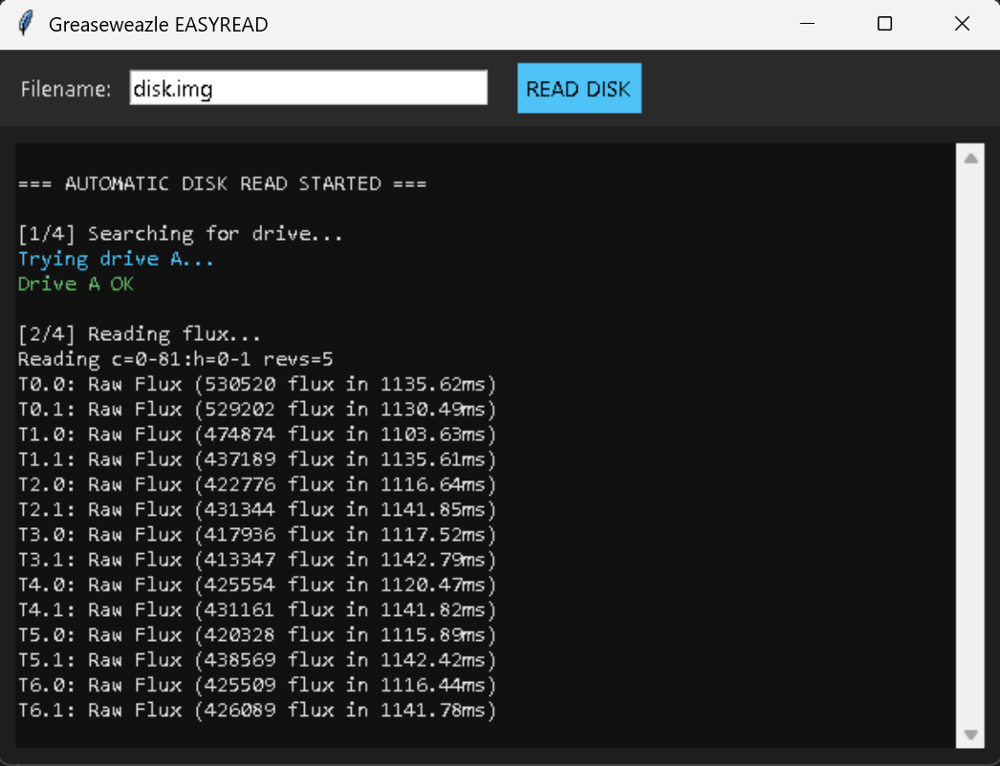

# Greaseweazle EasyRead

A Python GUI for reading floppy disks using a Greaseweazle device.

⚠️ **Recommended for 3.5" floppy disks only.**  
Other disk sizes and formats have **not been tested**.

---

## Beginner-Friendly Tool

This tool is designed as an **easy starting point** for using Greaseweazle.

If you:

- are new to floppy disk formats  
- don’t want to deal with format IDs, geometry, or command line tools  
- just want to insert a disk and start reading  

then this program provides a **simple one-button workflow**.

It automatically:

- detects the drive  
- reads raw flux data  
- tries common disk formats  
- creates a usable disk image  

---

---

## Features

- Automatic drive detection  
- Flux reading  
- Disk format detection  
- Image creation  

---

## Requirements

- Python 3.x  
- Greaseweazle installed  
- This script must be in the same folder as **gw.exe**

Download Greaseweazle:  
https://github.com/keirf/greaseweazle

---

## Usage

1. Place this script in the same directory as `gw.exe`
2. Run: python EasyRead.py
3. Insert floppy disk
4. Click **READ DISK**
5. Image files will be saved in the automatically created `dumps` folder

## Tested Configuration

✔ Tested only with **3.5" floppy disks**  
✔ Tested only with **Greaseweazle v4.1**  

Other hardware, formats, or firmware versions may or may not work.

---

## Disclaimer

Use at your **own risk**.

The author is **not responsible** for:

- data loss  
- damaged disks  
- hardware issues  

This project contains **only the GUI code**.  
Greaseweazle software itself is **not included**.
